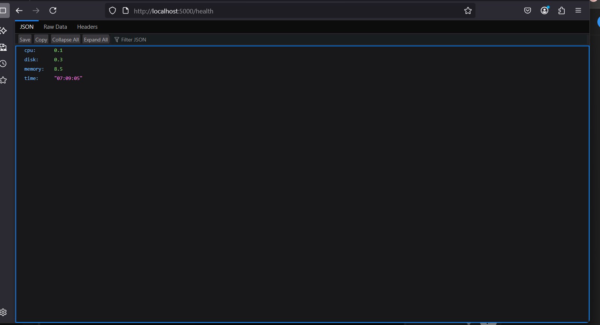

# System Health Dashboard

🔗 **Live Demo**: [https://system-health-dashboard.onrender.com](https://system-health-dashboard.onrender.com)

A lightweight Flask-based dashboard to monitor your system's real-time health — including **CPU**, **RAM**, **Disk usage**, and **system time** — all containerized with **Docker** and powered by **GitHub Actions CI**.

---

## Features

- Real-time system status (CPU, RAM, Disk)
- Backend: Python + Flask + psutil
- Simple HTML frontend
- Docker & docker-compose ready
- GitHub Actions CI integrated

---

## Tech Stack

| Layer     | Technology             |
|-----------|------------------------|
| Backend   | Python, Flask, psutil  |
| Frontend  | HTML                   |
| Container | Docker, docker-compose |
| CI/CD     | GitHub Actions         |

---

## 📸 Screenshot




##  How to Run Locally

### Using Docker (Recommended)

```bash
docker-compose up
```

- **Backend:** [http://localhost:5000/health](http://localhost:5000/health)
- **Frontend:** Open the file `index.html` in your browser (located at `backend/frontend/index.html`)

---

## Health Endpoint Sample Output

```json
{
  "cpu": "13%",
  "ram": "47%",
  "disk": "62%",
  "time": "2025-05-29 15:44:01"
}
```

---

## GitHub Actions CI

- Auto-runs on push to the `main` branch
- Verifies the `/health` endpoint is working using `curl`
- Ensures backend boots and responds properly

---

##  Next Steps

- Add live charts with Chart.js
- Deploy the project on platforms like Render or Railway
- Improve the UI and add auto-refresh functionality

---

## 🧑‍💻 Author

**Syntax-Vibe-Amir**  
🔗 GitHub: [github.com/Syntax-Vibe](https://github.com/Syntax-Vibe)
